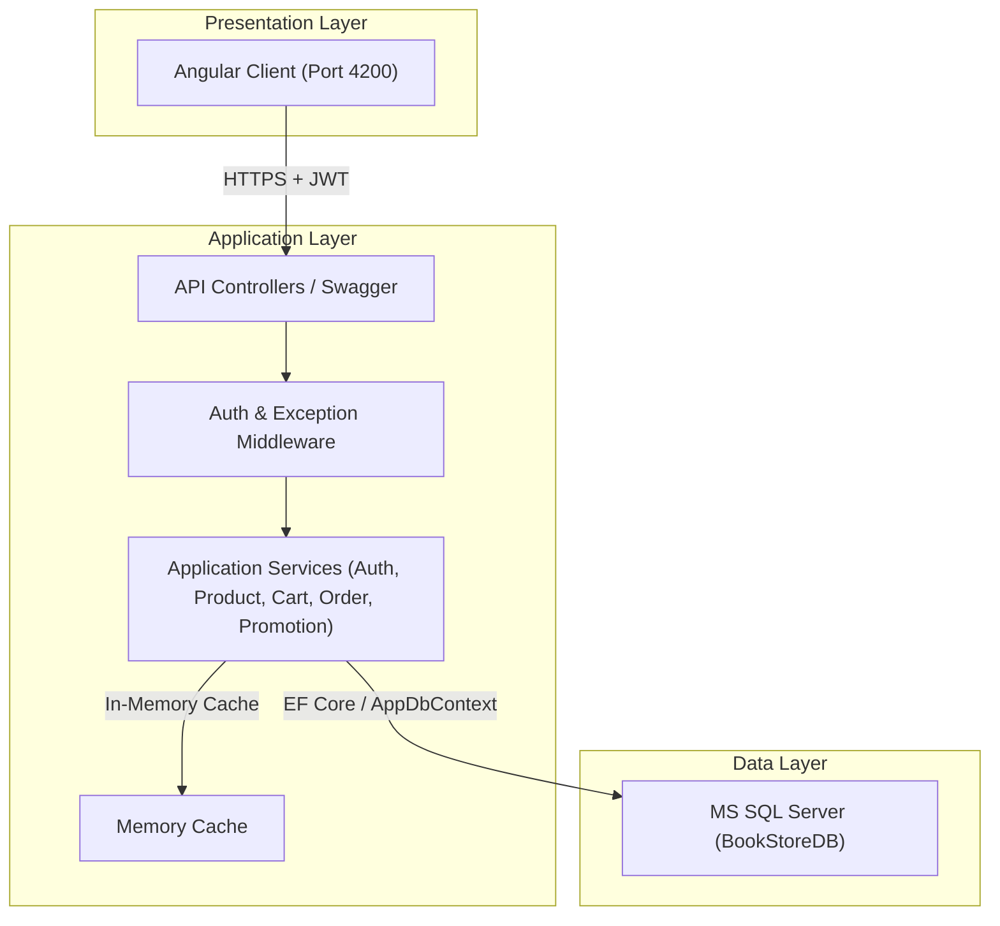

# E-Commerce Book Platform

This project is a complete online bookstore platform built with a client-server architecture. The backend is developed using ASP.NET Core Web API with Entity Framework Core and SQL Server, while the frontend is built using Angular with Tailwind CSS.

## Project Structure

* **e-commerce-book-platform**: ASP.NET Core Web API backend source code.
* **e-commerce-book-platform.client**: Angular frontend client source code.
* **template_database**: SQL Server database scripts for manual initialization and reference.

## System Architecture



## Tech Stack

### Backend API
* Framework: .NET Core (ASP.NET Core Web API)
* ORM: Entity Framework Core
* Database: Microsoft SQL Server
* Security: JWT (JSON Web Tokens) authentication, Role and Policy-based authorization (Admin, Manager, Employee, Customer)
* API Documentation: Swagger / OpenAPI

### Frontend Client
* Framework: Angular 22
* Styling: Tailwind CSS
* Test Runner: Vitest

## Setup and Running

### 1. Database Setup
The backend is configured to automatically create the database schema and seed default reference data on its first startup using Entity Framework Core's `EnsureCreated()` method in `Program.cs`.

If you need to change the connection string to target your local SQL Server instance, update the connection string configuration in `appsettings.json`:

```json
"ConnectionStrings": {
  "DefaultConnection": "Server=localhost;Database=BookStoreDB;Trusted_Connection=True;TrustServerCertificate=True;Encrypt=False"
}
```

Note: If you prefer manual database setup, you can run the SQL scripts located in the `template_database` folder directly against your SQL Server.

### 2. Running the Backend API
Ensure you have the .NET SDK installed on your system.

Navigate to the backend directory and run the application:
```bash
cd e-commerce-book-platform
dotnet restore
dotnet run
```
Alternatively, open the solution file `e-commerce-book-platform.sln` or `e-commerce-book-platform.slnx` using Visual Studio or JetBrains Rider, and press F5.

When the backend runs successfully, you can access the Swagger interactive API documentation at: `http://localhost:5000/swagger` (or the equivalent local port configured by the web host).

### 3. Running the Frontend Client
Ensure you have Node.js and npm installed.

1. Navigate to the client directory:
   ```bash
   cd e-commerce-book-platform.client
   ```
2. Install the package dependencies:
   ```bash
   npm install
   ```
3. Start the local development server:
   ```bash
   npm start
   ```
   The application will be accessible at: `http://localhost:4200/`

## Default Credentials
On the first run, the database seeding script automatically creates a default administrative account for testing:
* Email: `admin@bookstore.com`
* Password: `admin123`
* Role: Admin

## Running Tests
To execute frontend unit tests using the Vitest runner:
```bash
cd e-commerce-book-platform.client
npm run test
```
